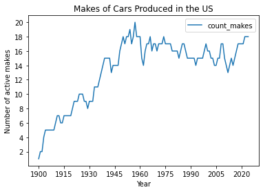

- This project scrapes information about cars manufactured in the United States from Wikipedia and produces a plot of the number of active makes over time.
- There are 5 main files:
    - `Buddy.py`, a `scrapy` `CrawlSpider`.
        - The spider takes the initial Wikipedia search URL and crawls each result for data about car models.
            - The `main` branch uses pagination to capture all search results.
            - The `unpaginated` branch uses a URL that captures all search results on a single page so the spider doesn't have to crawl through multiple pages of search results.
    - `pipelines.py`, which is a `Buddy` helper.
    - `cars.json`, which is generated by `Buddy.py` and contains information about cars produced in the United States.
        - This file remains empty until `run.py` is executed.
    - `analysis.py`, which converts the information in `cars.json` into a `DataFrame` and plot.
    - `run.py`, which executes the program
        - This file (and all other files) should be run from the project root directory, as all paths are relative.
- Check `requirements.txt` for a list of libraries used.
- Run `run.py` to execute the project.
- Below is the plot of the results of the project

  

- The number of active makes (a car make that had a vehicle for sale in a given year) witnessed a slow increase over the first half of the twentieth century, with a pronounced drop around the time of the 60s oil crisis in the US.
- A number of companies went bankrupt during the 2007-2008 Great Recession, with a recovery taking place now that many EV companies have been created in the US. 
- The number of active makes may be correlated with macroeconomic conditions in the US. 

